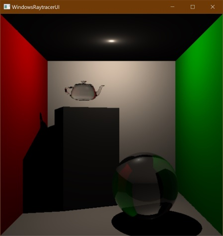

# edu.schwabe.raytracer

SSE/AVX based implementation of recursive raytracing (a.k.a. Whitted Raytracing). Creative commons CC-BY-NC-SA licensed.

This is my private raytracing project for hobby and learning purposes only.

## How to use

### Mouse control

Holding left button:

* moving the mouse rotates the camera

* holding SHIFT and moving translates the camera forward (when moving right or up) or backward (when moving left or down)

* holding CTRL and moving translates the camera sideward or up and down

* holding ALT and moving scales the world space (zooming in and out so to say)

Holding right button:

* moving the mouse translates the last-added light object on the world's Z-axis

* holding SHIFT and moving translates the last-added object on the world's Z-axis

### Key controls

*R* - Reset camera to world's origin and rotation towards world's Z-axis

*T* - Enable/disable fast preview, enabled by default (limits output image size -> less traces to perform)

*A* - Half the sampling-factor, which halves the output size proportionally

*S* - Increase the sampling-factor by one, which increases the output size linearly

*D* - Decrease trace depth to have less reflection and transmission traces

*F* - Increase trace depth to have more reflections and transmissions details (at some trace depth the changes in the image output is neglectable)

*J* - Decrease supersampling factor to have less traces per image pixel

*K* - Increase supersampling factor to enable anti aliased like sampling traces per image pixel

*SPACE* - Manually trigger trace again (f.e. to compare changes in trace time for the very same perspective)

*ENTER* - Manually trigger trace with disabled fast preview

_For debugging purposes:_

*W* - Write last raytracing output to file "raytraced.bmp" in current working directory

*E* - Cycle through the output types

1. Raytraced image of the world

1. Trace time map

1. Trace depth map

*Q* - Change culling orientation

*G* - Decrease ray packet size (currently it has very less effect on the performance as packeted raytracing is not really implemented)

*H* - Increase ray packet size again

## Technology stack

The raytracer (raytracing VC++-project as static library) features:

* A simple scene management (currently compile-time static)

* KD-Tree partitioning API for generating and traversing acceleration structures

* Traced reflections and transmissions

* OpenMP simple parallelization

* Simple BRDF lightning model (

    * Schlick-Fresnel refraction

    * Phong-based specular reflections

    * Beer-Lambert-Law-based diffused and transmitted lightning

All or almost all math is implemented with intrinsic instructions (vectorization VC++-project as static library)

* SSE3 is used by default.

* Use of SSE4, AVX and FMA instructions can be enabled at compile-time.

* Third party implementations are used for vectorized exp and log functions

* Unit tests are provided with Visual C++ component tests

The UI is implemented with the standard Windows API (raytracerui VC++-project as Windows executable)

* Output of the raytracing can be blitted either with a GDI StretchDIBits or an OpenGL implementation (latter has no effect on the performance of the raytracing!)

* QT UI is planned

## TODO

Refactor partitioning API so that generation and traversal of acceleration structures

* can be invoked dynamically via standard Stragety-pattern-based interfaces

* but actual generation and traversing code is fully compile-time optimizeable

Use QT for a more fancy, intuitive and comprehensible UI

* Provide visible controls next to the blitted output instead of the mouse and key listeners hidden in code.

Implement packeted raytracing to group similar rays for more efficient packeted intersection tests.

Provide structure of arrays for more efficient intersection tests for the triangle meshes.

Refactor Raytracer.cpp so that different tracing strategies can be used, f.e. to implement a path tracer.
