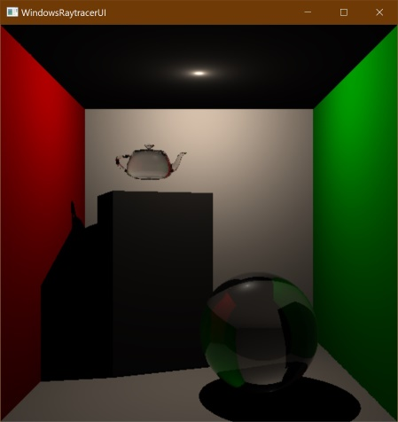

# edu.schwabe.raytracer

SSE/AVX implementation of recursive raytracing (a.k.a. Whitted Raytracing). Creative commons CC-BY-NC-SA licensed.

This is my private raytracing project for hobby and learning purposes only.

## Prepare

### Repository

This repository uses another repository of mine (https://github.com/falkosch/cmake-modules) as a submodule for the cmake
modules contained in `./cmake`.

You can either clone this repository with the submodules
using `git clone --recursive https://github.com/falkosch/edu.schwabe.raytracer.git` or alternatively
run `git submodule update --init --recursive` if you cloned this repository without the `--recursive` parameter.

### Prepare data folder

See [instructions in the data folder](./data/README.md).

### Install dependencies

If you open this repository as a cmake project in Visual Studio, e.g. VS Community 2022,

1. Install [vcpkg](https://vcpkg.io/en/getting-started).
2. Add a `VCPKG_DIR` environment variable pointing to the directory, which contains the `vcpkg.exe`.
3. Add the same directory to the `PATH` environment variable as well.
4. Run `vcpkg install` to let vcpkg install the required dependencies to `./vcpkg_installed`.

With a local gcc setup, you can use the `./*.sh` scripts, which will take care of providing the dependencies. You need
to have `gcc`, `cmake`, and `conan` installed.

### Compile binary

When using Visual Studio, have `vcpkg` installed as described above and in VS build the cmake project or run
the `rayreacerui.exe (sources\raytracerui\raytracerui.exe)` target.

With a local gcc setup, you can use `./build-with-local-cc.sh` or `./run-with-local-cc.sh` to build or run the
executable.

## System Overview

The application is currently parted into three subprojects representing, each representing one of the three
layers/components/parts:

* _vectorization_ is a static library for the fundamental support for SSE/AVX FP computations.
* _primitives_ is a static library providing geometric primitives like spheres, cubes, planes, which can be added to a
  scene.
* _raytracing_ is a static library of the raytracer backend. Here you will find the scene management,
  partitioning of the scene and its objects and the actual raytracer kernel, which is implemented as a
  Whitted-raytracer.
* _raytracerui_ contains the simple frontend and a basic setup of different scenes.

## How to use

### Mouse control

Holding the left button:

* moving the mouse rotates the camera
* holding SHIFT and moving translates the camera forward (when moving right or up) or backward (when moving left or
  down)
* holding CTRL and moving translates the camera sidewards or up and down
* holding ALT and moving scales the world space (zooming in and out)

Holding the right button:

* moving the mouse translates the last-added light object on the world's Z-axis
* holding SHIFT and moving translates to the last-added object on the world's Z-axis

### Key controls

*R* - Reset camera to world's origin and rotation towards the world's Z-axis

*T* - Enable/disable fast preview, enabled by default (limits output image size → fewer traces to perform)

*A* - Half the sampling-factor, which halves the output size proportionally

*S* - Increase the sampling-factor by one, which increases the output size linearly

*D* - Decrease trace depth to have less reflection and transmission traces

*F* - Increase trace depth to have more reflections and transmission details (at some trace depth the changes in the
image output are negligible)

*J* - Decrease the antialiasing factor to have fewer traces per image pixel

*K* - Increase the antialiasing factor to enable anti aliased like sampling traces per image pixel

*SPACE* - Manually trigger trace again (f.e. to compare changes in trace time for the very same perspective)

*ENTER* - Manually trigger trace with disabled fast preview

_For debugging purposes:_

*W* - Write last raytracing output to the file "raytraced.bmp" in the current working directory

*E* - Cycle through the output types

1. Raytraced image of the world
2. Trace time map
3. Trace depth map

*Q* - Change culling orientation

*G* - Decrease ray packet size (currently it has very less effect on the performance as packed raytracing is not really
implemented)

*H* - Increase ray packet size again

## Technology stack

The raytracer features:

* A simple scene management at compile-time
* KD-Tree-based partitioning API for generating and traversing acceleration structures
* OpenMP simple parallelization
* Unit tests implemented as Visual C++ component tests
* UI is implemented with the standard Windows API (raytracerui VC++-project as Windows executable).
* Raytrace output as an image can be blit with
    * a GDI StretchDIBits implementation or
    * an OpenGL implementation (has no effect on raytracing performance)
* Simple BRDF lightning model
    * Trace of reflections and transmissions
    * Schlick-Fresnel refraction
    * Phong-based specular reflections
    * Beer-Lambert-Law-based diffused and transmitted lightning

Vector math is implemented with intrinsic instructions (vectorization VC++-project as a static library)

* Supports SSE4, AVX and FMA instructions
* SSE4 is used by default.
* Vectorized exp and log trigonometry functions use third party implementations sse_mathfun.h and avx_mathfun.h (see
  Credits).

## Credits

Project is set up with *[The C++ CMake Project Template](https://github.com/cginternals/cmake-init)*

Uses [sse_mathfun.h](http://gruntthepeon.free.fr/ssemath/) and [avx_mathfun.h](http://software-lisc.fbk.eu/avx_mathfun/)
in vectorized exp and log trigonometry functions.
