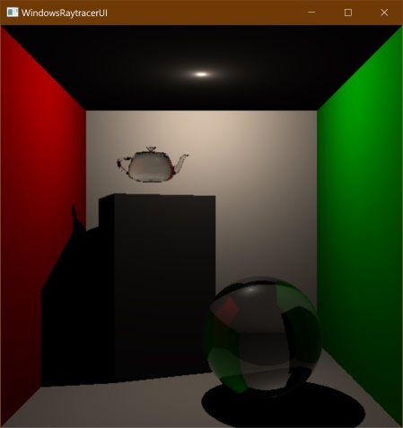

[](https://sonarcloud.io/dashboard?id=edu.schwabe.raytracer)
[](https://sonarcloud.io/dashboard?id=edu.schwabe.raytracer)
[](https://sonarcloud.io/dashboard?id=edu.schwabe.raytracer)

# edu.schwabe.raytracer



SSE/AVX-vectorized Whitted raytracer in C++23. Windows-only UI (Win32 + OpenGL + Dear ImGui). Private hobby and
learning project, licensed under Creative Commons CC-BY-NC-SA.

## Setup

### Clone

This repository uses [cmake-modules](https://github.com/falkosch/cmake-modules) as a submodule under `./cmake`. Clone
recursively:

```
git clone --recursive https://github.com/falkosch/edu.schwabe.raytracer.git
```

If you already cloned without `--recursive`, run `git submodule update --init --recursive`.

### Data folder

Unpack `data/data.zip` into `data/` so it contains `meshes/` and `textures/`. See
[data/README.md](./data/README.md).

### Dependencies

Install [vcpkg](https://vcpkg.io/en/getting-started), set `VCPKG_DIR` to the directory containing `vcpkg.exe`, and add
the same directory to `PATH`. GLEW is the only vcpkg-managed dependency.

### Build

Open as a CMake project in Visual Studio (e.g. VS Community 2022) and build the `raytracerui` target, or configure
directly with CMake + Ninja using the `x64-windows-static` triplet and the vcpkg toolchain file. The executable must
be run from a directory with access to `data/`.

## System overview

Four targets in a strict dependency chain:

* **vectorization** — SIMD wrapper library over SSE4/AVX/FMA intrinsics. Core types `v_f32_4`, `v_i32_4`, `v_ui32_4`,
  `v_ui64_2`, `m_f32_4x4`. Vectorized exp/log come from `sse_mathfun.h` / `avx_mathfun.h` (see Credits).
* **primitives** — geometric types: Ray, AABB, BoundingSphere, Facet, SplittingPlane, …
* **raytracing** — scene management, KD-tree partitioning (multiple balancer strategies and traversers), Whitted
  kernel, BRDF shading (Schlick-Fresnel refraction, Beer-Lambert transmission, Phong specular), OpenMP
  parallelization.
* **raytracerui** — Win32 + OpenGL frontend with Dear ImGui overlay. Predefined scenes: CornellBox, Dragon,
  Procedural, TestScene1/2, TestLight.

Rendering runs on a background `std::jthread`; the UI thread triggers renders non-blockingly and receives completion
via `WM_RENDER_COMPLETE`. Scene mutations (e.g. KD-tree rebuilds) are serialized with rendering through an
enqueue-work pattern.

## UI

Most parameters are exposed in ImGui panels. Toggle with function keys:

* **F1** — Controls reference
* **F2** — Metrics (timing, MRays/s, ray statistics, KD-tree info)
* **F3** — Configuration (sampling factor, max trace depth, super-sampling, ray packet size, culling, KD-tree
  balancer, FOV, interaction mode, fast preview, display mode, *Save As* PNG/BMP, full-quality render)
* **F4** — Log

### Mouse and movement

* **W / A / S / D** — move forward / left / back / right
* **Space / C** — move up / down
* **Right-mouse drag** — depends on interaction mode (set in F3 or via `1`/`2`/`3`):
    * `1` Camera — rotate view
    * `2` Object — translate last-added object on Z
    * `3` Light — translate last-added light on Z
* **Left-mouse drag** (Object mode only) — scale last-added object

### Keyboard shortcuts

* **Enter** — full-quality render (bypasses fast preview)
* **R** — reset camera
* **T** — toggle fast preview
* **E** — cycle display mode (image / timing map / depth map)
* **Q** — cycle culling orientation (back / none / front)
* **J / K** — decrease / increase super-sampling factor
* **G / H** — decrease / increase ray packet size

The first rendered frame is auto-saved to `ray-traced.png` in the working directory.

## Credits

Project scaffold: [The C++ CMake Project Template](https://github.com/cginternals/cmake-init).

Vectorized exp/log via [sse_mathfun.h](http://gruntthepeon.free.fr/ssemath/) and
[avx_mathfun.h](http://software-lisc.fbk.eu/avx_mathfun/).

UI overlay via [Dear ImGui](https://github.com/ocornut/imgui).
